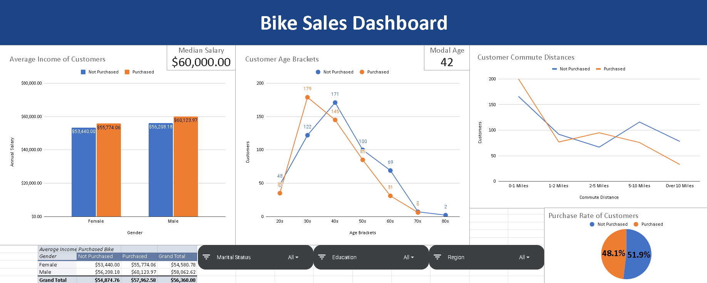

# Bike Sales Dashboard
This is a dashboard that uses customer data from bicycle sales to give some insights about the customer demographics. The data was first cleaned. Then the dashboard was built using Google Sheets. Either Excel or Sheets could be used to make this dashboard. I used Sheets.

I did a small amount of data cleaning first. I copied the dataset into a new sheet so that I could alter it without risking the original. Some data such as male and female labels were entered as one letter. As a convenience to the user, I spelled them out fully as Male and Female. I also filtered the customers' ages into 10 year age brackets to make the data easier to understand.

In the dashboard, I created a graph for the average income of the customers, a graph for the average age, and a graph for the average commute distance. I also included three slicers for the user to do more exploration into the data.

